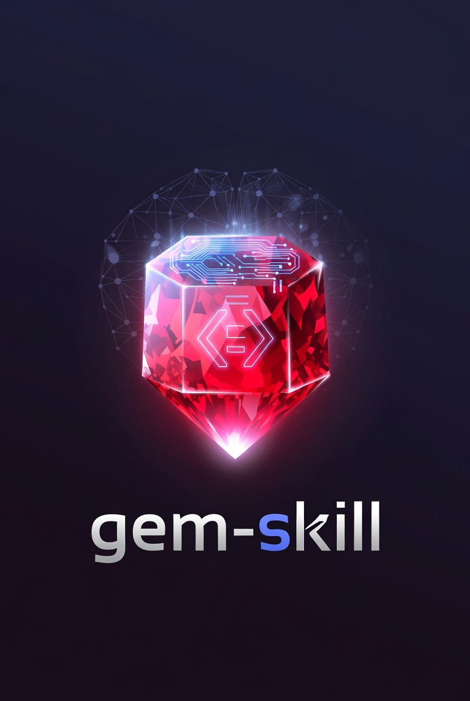

<p align="center">
<table style="width:38%;margin:0 auto;" border="0" cellpadding="8">
  <tr>
    <td width="40%"></td>
    <td width="60%">
      Generate <code>SKILL.md</code> files for AI coding assistants
      (Claude Code, OpenAI Codex, and others) from Ruby gem documentation,
      and cache them globally so every project that uses a gem can share the
      same pre-built knowledge.<br><br>
      <strong><a href="https://madbomber.github.io/gem-skill">Full documentation →</a></strong>
    </td>
  </tr>
</table>
</p>

## The problem it solves

Every time an AI coding assistant encounters a gem it hasn't seen in the current
context, it re-reads the README, scans examples, and figures out the API. That
costs tokens and time — and the result evaporates when the conversation ends.

`gem-skill` runs that pipeline once, offline, and stores the output as a
`SKILL.md` in `~/.gem/skills`. Projects symlink to the cached version, so your
assistant has accurate, version-specific knowledge about each gem without
repeating the ingestion work. `SKILL.md` is a shared format — Claude Code,
OpenAI Codex, and other assistants all read it.

## Quick start

```bash
# 1. Install
gem install gem-skill

# 2. Register the Bundler plugin (once per machine)
gem skill setup

# 3. Generate a skill for any installed gem
gem skill install debug_me

# 4. In a project — generate skills for all direct dependencies
cd your-project
bundle skill install
```

## How it works

```
gem README / changelog / RubyGems API
        ↓
   Fetcher collects docs
        ↓
   Generator calls LLM (ruby_llm)
        ↓
   SKILL.md cached at ~/.gem/skills/<gem>/<version>/
        ↓
   Linker creates .claude/skills/<gem> → cache dir
        ↓
   The assistant reads SKILL.md automatically
   (Claude Code from .claude/skills/; other assistants from their own roots)
```

All concurrent work is handled by async fibers — multiple gems are processed
simultaneously with live TTY spinner progress.

## Key features

- **Global cache** — generate once, use everywhere; skills are version-specific
- **Gemfile.lock awareness** — `bundle skill install` installs skills for every direct dependency including gemspec runtime deps
- **Concurrent** — all LLM calls run concurrently via async fibers
- **Two interfaces** — `gem skill` for global cache management, `bundle skill` for project-aware linking
- **Auto-install** — `gem install --with-skill` generates skills during normal gem installation
- **Configurable** — `GEMSKILL_DIR`, `GEMSKILL_PROJECT_DIR`, and `GEMSKILL_MODEL` environment variables
- **Multi-assistant** — `SKILL.md` works with Claude Code, OpenAI Codex, and others; `GEMSKILL_PROJECT_DIR` points project links at the right directory
